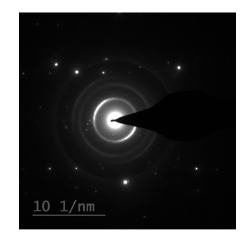
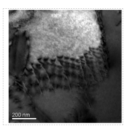

## Post test
 

1.Temperature of sample is kept near that of liquid nitrogen, EXCEPT for which reason?  

a.To avoid any damage from electron beam  

<b>b.To stabilise the voltage of electron gun </b> 

c.To avoid re-condensation of dirt on sample  

d.To avoid vitrification of sample.  

 

2.Which of the following is the most important lens in a TEM?  

a.Projector lens 

<b>b.Objective lens</b>  

c.Condenser lens  

d.Intermediate lens  

 

3.The following is _____________________ . 

 

a.Bright Field Image 

<b>b.Selected area diffraction</b> 

c.Kikuchi line  

d.Back-scattered electron image  

4.The following is _____________________ . 

 

<b>a.Bright Field Image</b> 

b.Selected area diffraction 

c.Kikuchi line  

d.Back-scattered electron image 
