<b>TEM Instrumentation:</b>  
Transmission electron microscope (TEM) is a very strong tool to obtain microstructural and sub-microstructural information, along with the corresponding atomic orientation from diffraction pattern of the crystals. The resolution of TEM is to the tune of ~0.1 nm. The sample preparation is very tedious and is explained in an earlier experiment. In summary, sample must be transparent, Figure 1, to electrons in order for its imaging and obtaining phase-orientation information. The TEM directs incident electron beam on the sample, but the resulting signal is captured after the electron beam has interacted and passes through the sample, Figure 2. For transmitted electrons, the sample must be thin enough to allow passage of electrons through the sample. Herein, again, electron can be transmitted without any interaction or can also be elastically scattered or inelastically scattered. 

 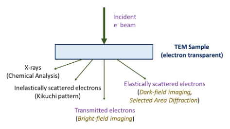 
Fig 1: summary of various signals obtained by interaction of electrons with matter in an electron microscope.  
<b>Instrumentation and Importance of Filament, Voltage and Vacuum: </b>

The transmission electron microscope (TEM), Fig. 2, consists of electron gun to generate the electrons followed by set of electromagnetic coils to control the beam size and shape (to make parallel or convergent or divergent for various characterisations). Typically, thermionic (W-filament), and field-emission (using LaB6, CeB6 filaments) is used for generating electrons. Anode repels the electrons to constrict the diverging beam, and the set of electromagnetic lens (condenser lens) focuses the beam on the sample. The sample is kept in a cold chamber (in liquid nitrogen condition) in order to stabilise and restrict its damage upon electron beam irradiation. A liquid nitrogen dewar provides condensation of ionised atoms in the vicinity (in the immediate environment near sample) so as not to interfere with the sample imaging and characterisation. The electron beam passing through the electron-transparent sample falls on the objective lens. The objective lens is most important lens as it generates the first image of the sample, which is magnified using projective lens.  
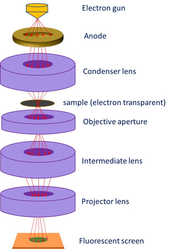  
Figure 2: Schematic showing the placement of electromagnetic lenses and specimen in the transmission electron microscope. Note that the signal is captured after the electron beam passes through the sample.  
The TEM set-up requires very stable and high-voltage (orders of 120 kV to 2 MV, and typically 200 kV is used) and high level of vacuum (10-6- 10-8 torr). An electron gun is required to generate and accelerate electron at high energy. The generation of images (both bright field or dark field) or diffraction pattern in the TEM is explained later along with aspects of imaging and contrast. The description starts with the variation of electron beam wavelength with respect to accelerating voltage. It may be noted that resolution of image depends on the wavelength of electron, which can be decreased (in order to obtain higher resolution) by increasing accelerating voltage. Typical accelerating voltages are ~200 kV, and special, high resolution TEM may utilise up to 2 MeV energy (or 2 MV voltage). The resolution of the electron beam depends on the electron wavelength (dependent on the accelerating voltage) as follows:
The generation of images (both bright field or dark field) or diffraction pattern in the TEM is explained later along with aspects of imaging and contrast. The description starts with the variation of electron beam wavelength with respect to accelerating voltage. It may be noted that resolution of image depends on the wavelength of electron, which can be decreased (in order to obtain higher resolution) by increasing accelerating voltage. Typical accelerating voltages are ~200 kV, and special, high resolution TEM may utilise up to 2 MeV energy (or 200 MV voltage). The resolution of the electron beam depends on the electron wavelength (dependent on the accelerating voltage) as follows:   
The De-Broglie Wavelength (λ) of electron is given as: 
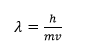      (1) 
Where h is the Plank’s constant, m and v are the mass and velocity, respectively, of the electron.  
Now, the kinetic energy (E) of the electron are provided as  
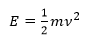  <b>or</b> 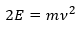 <b>or</b> 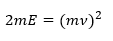     (2) 
Fitting (2) in (1) gives: 
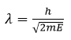<b>or</b>&nbsp;&nbsp;&nbsp;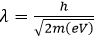       (3)  
Inserting the required values, we obtain the dependence of wavelength (λ) of incident electron on the accelerating voltage (V): 
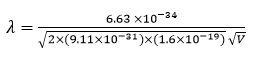  <b>or</b>  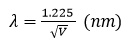         (4) 
This is a very important relation to know the wavelength of electron from the accelerating voltage. You may recollect that the wavelength of incident radiation decides the resolution of the system. So, smaller the wavelength (or higher the accelerating voltage), the better the resolution (or smaller the distance which can be separated or resolved) by imaging. 
Note: The relativistic mass of electron (m) is given as 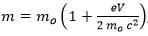 where m0 is the rest mass. Thus, the non-relativistic electron wavelength (provided in eq. (4)) is usually higher than the relativistic wavelength of electron).  
<b>TEM Imaging/ Diffraction </b> 

Set of electromagnetic lenses form a condenser system that is utilised to get a parallel or convergent beam for imaging/diffraction. Then, objective electromagnetic lens forms the heart of TEM system that is utilised to form the first intermediate image. The quality of this image decides the resolution of the final image. The diffraction and intermediate lens are switched to result diffraction or imaging, respectively. The projection lens forms the second intermediate image (either diffraction pattern or the image). The column tube (typically few mm in diameter) through which the electron beam passes must be very clean otherwise its interaction with the column itself may scatter the beam and provide poor signals. Therefore, the sample is kept under cryogenic conditions (usually under liquid nitrogen) so the ionised material (after interaction with incident beam) condenses right there (i.e. not allowing the free ion/atom to wander into column tube and condense there had the sample was not cooled).  So, usually a liquid nitrogen dewar is used to maintain low temperature near the TEM specimen. Final image or diffraction pattern is observed on the viewing screen or camera. 

The ray-diagram for the TEM is presented in Figure 3. TEM can produce images, when the aperture is kept at back-focal plane of objective lens. Alternately, diffraction pattern can result when the aperture is kept at image plane of objective lens. 
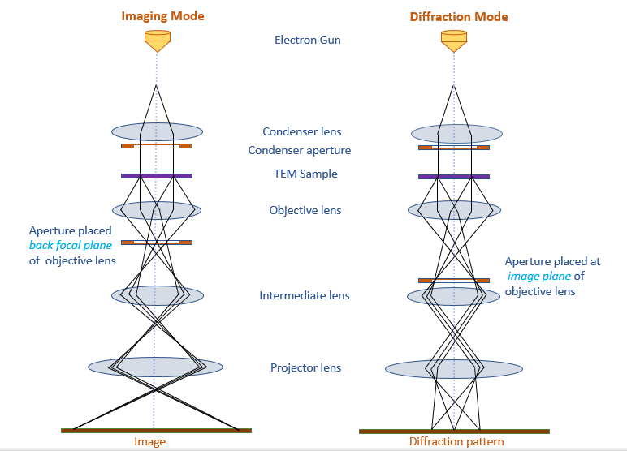  
Figure 3: Ray-diagram eliciting the placement of aperture in obtaining image (left figure) or diffraction pattern (right figure).  
When the aperture is placed at the back-focal plane of objective lens, a bright field image is resulted (Fig. 4a), whereas when the aperture is placed at image plan of objective lens, the diffraction pattern results. Note that the diffraction can be taken from a selected area (Fig. 4b) called selected area diffraction). The diffraction can show a certain pattern (i.e. individual spots from a single-crystal region, or rings arising from nanocrystalline region, or scattered overlapping spots from a few different crystals). Note that the bright field images show bright field (and features appear dark), and the units of length (to the typical tune of nm) is obtained (Fig. 4a). Whereas, the diffraction image is obtained in the reciprocal space (so the units of 1/nm) are observed. The pattern changes depending upon how the electron beam interacts with the matter and how many crystals interact to provide the resulting image. The symmetry of the real crystal decides the final pattern obtained in the diffraction image. A detailed analysis of those will be taken up in another experiment.   
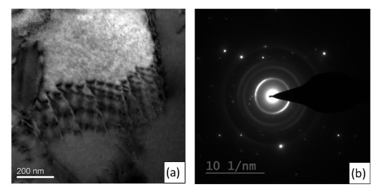 
Fig. 4: a) Bright field image and b) selected area diffraction for a ceramic sample in transmission electron microscopy.  
<video width="320" height="240" controls>
  <source src="exp5-tem.mp4" type="video/mp4">
  Your browser does not support the video tag.
</video> Video on Basic operations of Transmission Electron Microscope (Imaging and Diffraction Pattern)